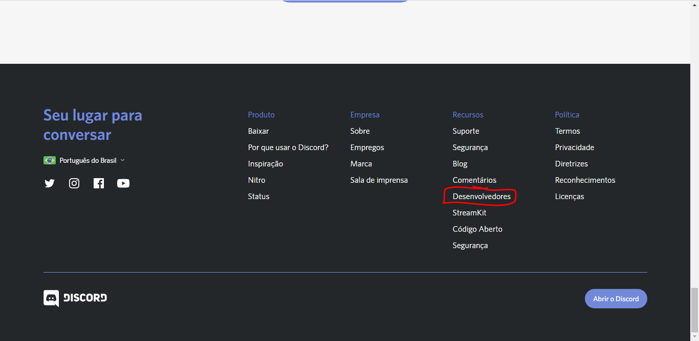
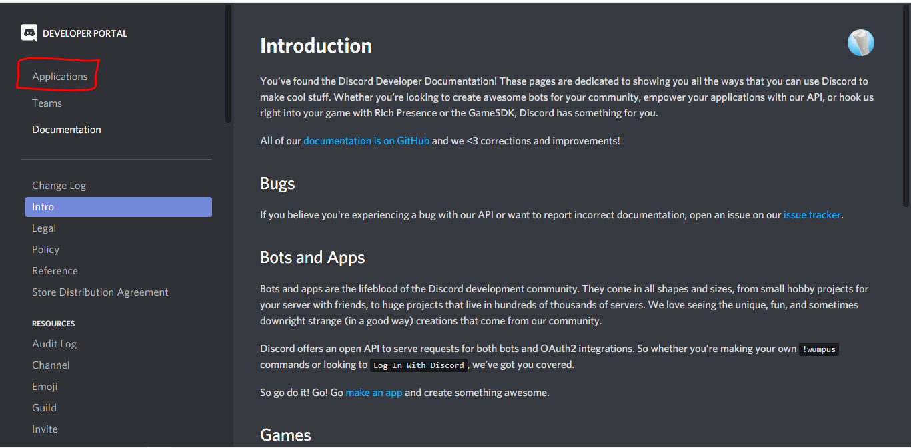

# Coffe

[Português](#Português) |
[English](#English)

## Português
Um Bot para o Discord de código aberto, que usa a biblioteca [Discord.js](https://discord.js.org/#/)!

### Aviso
**Antes de tudo, para seu bot funcionar corretamente, modifique o arquivo *config.json* para *info.json*! (RECOMENDADO)**

**Ou você pode entrar em todos os arquivos que requerem o *info.json* e modificar a linha:**
```js
const config = require("./info.json");
```
para:
```js
const config = require("./config.json");
```

#### Links
[Como usar](#Como-usar) |
[Criando bot no Discord](#Criando-bot-no-discord)

### Como usar?
Para rodar o bot na sua máquina, primeiramente você deve ter instalado o **NodeJS**, e ter [criado um bot na área de desenvolvedor do Discord](#Criando-bot-no-discord).

Após esses dois passos concluídos, copie o *token* do seu bot, e cole na área reservada para o token no arquivo **info.json** dentro dos arquivos do bot.

Neste mesmo arquivo **info.json**, você vai perceber que existem outras informações que tem uma descrição do que deve ser colocado alí, preencha-as corretamente!

Se você estiver utilizando o **Visual Studio Code** como editor de códigos, nele abra a pasta do bot, em seguida abra o terminal, e execute dentro do terminal o seguinte comando:
```
node index.js
```

Se deseja rodar o bot usando o **PowerShell**, primeiro entre atravez do PowerShell na pasta do seu bot (use cd caminho_da_pasta), em seguida execute o comando:
```
node index.js
```

E pronto, seu bot ficará online, mostrando no terminal a quantidade de pessoas, de servidores e de canais, também vai ser exibida uma lista com o nome de todos os servidores que o bot está presente!

**LEMBRE-SE que seu bot só ficará online enquanto sua máquina estiver ligada, ou até o momento que você parar de rodar o bot (pode usar *"CTRL + C"* dentro do terminal para parar o bot).**

### Criando bot no discord
Você precisa criar uma aplicação no discord para que o código tenha onde "rodar". Se não sabe fazer isso siga esses passos:

1. Acesse o [site oficial do discord](https://discord.com/new)
2. Procure a *"Área de desenvolvedores"*
    
3. Dentro do portal do Desenvolvedor clique em *"Applications"/"Aplicações"*!
    
4. Clique em *"New Applications"/"Nova aplicação"*
    
5. Coloque o nome do seu bot e clique em *"Create"/"Criar"*
    
6. Do lado esquerdo, clique em *"Bot"*, logo em seguida em *"Add Bot"* e confirme!
    
    
7. Pronto! Seu bot foi criado, agora copie o **Token** e cole no **config.json** do seu bot!
    

### Comandos do bot

* **Comandos do tipo Geral**
    * say
        O comando **say** é um comando simples, mas com algumas maneiras diferentes de ser usado.
        O modo mais normal de usá-lo
[...]README INCOMPLETO

---

## English
An open source Discord Bot, using the [Discord.js](https://discord.js.org/#/) library!

### Warning
**First of all, for your bot to work correctly, modify the file *config.json* to *info.json*! (RECOMMENDED)**

**Or you can enter all files that require *info.json* and modify the line:**
```js
const config = require("./info.json");
```
for:
```js
const config = require("./config.json");
```

#### Links
[How to use](#How-to-use) |
[Creating bot on Discord](#Creating-bot-on-discord)

### How to use?
To run the bot on your machine, you must first have installed **NodeJS**, and [created a bot in the Discord developer area](#Creating-bot-on-discord).

After these two steps are completed, copy the *token* of your bot, and paste it in the area reserved for the token in the file **info.json** inside the files of the bot.

In this same file **info.json**, you will notice that there is other information that has a description of what should be placed there, fill it in correctly!

If you are using **Visual Studio Code** as a code editor, open the bot folder there, then open the terminal, and run the following command inside the terminal:
```
node index.js
```

If you want to run the bot using **PowerShell**, first enter PowerShell in your bot folder (use cd path_of_folder), then run the command:
```
node index.js
```

And ready, your bot will be online, showing in the terminal the number of people, servers and channels, it will also be displayed a list with the name of all the servers that the bot is present!

**REMEMBER that your bot will only be online while your machine is on, or until the moment you stop running the bot (you can use * "CTRL + C" * inside the terminal to stop the bot).**

### Creating bot on discord
You need to create an application on discord so that the code has nowhere to "run". If you don't know how to do this, follow these steps:

1. Visit the [official discord website](https://discord.com/new)
2. Search for the *"Developer Area"*
    
3. Within the Developer portal click on *"Applications"*!
    
4. Click *"New Applications"*
    
5. Enter the name of your bot and click *"Create"*
    
6. On the left side, click on *"Bot"*, then on *"Add Bot"* and confirm!
    
    
7. Ready! Your bot has been created, now copy the **Token** and paste it into the **config.json** of your bot!
    


    
[...]INCOMPLETE RADME
